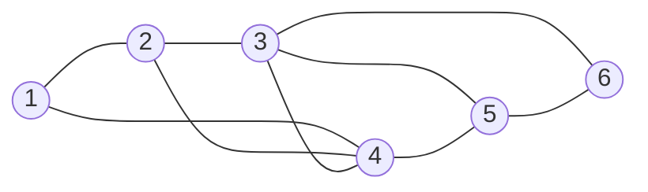

# Data Structure hw1

*信计23 杨其霄 202300091132*

## Q2


### Solution

**(1)** **基本语句**：初始化赋值，一个while循环，循环内部包括常数时间的加法、乘法、赋值和自增。

**执行次数**：总共进行n + 1次while循环，每次while循环里执行一次加法一次乘法，均是$O(1)$级别的操作，总执行次数是$1 + n + 1 + n + n + n = 4 n + 2$（1是初始化赋值）**时间复杂度**：$O(n)$

**(2)** 和上一题的区别仅在于while循环换成了do-while循环，执行次数不变

**时间复杂度**：$O(n)$

**(3)** **基本语句**：初始化赋值，一个while循环，内部有一个if判断，之下有自增操作。

**执行次数**：while循环条件为i+j<=n，由初始值和循环体可知i和j的值在每次循环依次+1，因此总的循环次数是n。if和后缀自增都是常数时间，总的执行次数是1 + n + n

**时间复杂度**：$O(n)$

**(4)** **基本语句**：赋值，while循环，赋值和加法。

**执行时间**：$(y + 1)(y + 1) = y^2 + 2y + 1 = n$的y最大是$O(\sqrt{n})$级别，y每次循环+1，因此循环次数是$O(\sqrt{n})$，y=y+1常数时间。

**时间复杂度**：$O(\sqrt{n})$

**(5)** **基本语句**：三重for循环，x自增。

**执行次数**：x自增是常数时间，只用看循环条件。先看内层j和k循环，j为1k执行1次，j为2k执行2次...j为i，k执行i次。因此内层执行数是：
$$
\sum_{k = 1} ^ {i}k = \frac{i(i + 1)}{2}
$$
再看i和内层，i执行n次，总执行次数便是：
$$
\sum_{i = 1} ^ {n} \frac{i(i+1)}{2} = \frac{1}{2} \left [ \frac{n(n+1)(2n+1)}{2} + \frac{n(n+1)}{2} \right] = \frac{n(n+1)(n+2)}{6}
$$
**时间复杂度**：$O(n^3)$

**(6)** **基本语句**：双重for循环，赋值语句。

**执行次数**：最后的赋值语句是$O(1)$的，看循环次数。内层每次执行次数为$n-2i + 1$，i求和上界为m=floor(n/2)，求和：
$$
\sum_{i = 1} ^ {m}n-2i + 1 = mn + m-2\sum_{i = 1} ^ {m}i = mn + m - 2\cdot \frac{m(m+1)}{2} \\
=mn + m-mm-m = m(n-m)
$$
再代入m=floor(n/2)，$O(m(n-m)) = O(\frac{n^2}{4}) = O(n^2)$

**时间复杂度**：$O(n^2)$

## Q3


### Solution

**(1)**



由于有圈的存在，该结构是图。

**(2)** Integer API

```cpp
#include <stdexcept>
class Integer {
    private:
        int value;
    public:
        Integer(int v = 0) :value(v) {}
        
        int get() {
            return value;
        }

        void set(int v) {
            value = v;
        }

        Integer add(Integer other) {
            return Integer(get() + other.get());
        }

        Integer sub(Integer other) {
            return Integer(get() - other.get());
        }

        Integer mul(Integer other) {
            return Integer(get() * other.get());
        }

        Integer divide(Integer other) {
            if (other.get() == 0) {
                throw std::invalid_argument("Divided by zero");
            }
            return Integer(get() / other.get());
        }

        bool equals(Integer other) {
            return get() == other.get();
        }

        bool lessThan(Integer other) {
            return get() < other.get();
        }

        bool greaterThan(Integer other) {
            return get() > other.get();
        }
        
        void addTo(int v) {
            set(get() + v);
        }

        void subTo(int v) {
            set(get() - v);
        }
};
```

**(3)** 第一个算法执行n次加法，n次数乘，1+2+...+(n-1)次变量相乘，总执行次数：
$$
T=n + n + \sum_{k = 1} ^ {n-1}k = 2n+\frac{n(n-1)}{2}=\frac{n^2}{2} + \frac{3n}{2}
$$
总的复杂度是$O(n^2)$，第二个算法进行n次加法，n次乘法，总的复杂度是$O(n)$。因此第二种算法好。

## Q4(2)


### Solution

**1.设计思路**

双指针实现，从头和尾遍历string，如果str[head] != str[tail]就return false。否则更新指针。最后遍历完string后return true。

**2.伪代码**

```cpp
left = 0; right = str.size - 1;
while (left < right) {
    if (str[left] != str[right]) {
        return false; 
    }
    left++; right--;
}
return true;
```

**3.cpp code**

```cpp
#include <iostream>
#include <string>

bool check(const std::string& str);

int main() {
    std::string str;
    std::cin >> str;
    if (check(str)) {
        std::cout << "Yes";
    } else {
        std::cout << "No";
    }

    return 0;
}

bool check(const std::string& str) {
    if (str.empty()) {
        return true;
    }
    int left = 0; int right = str.size() - 1;
    while (left < right) {
        if (str[left] != str[right]) {
            return false; 
        }
        left++; right--;
    }
    return true;
}

```

**4.复杂度分析**

双指针遍历长度为n的容器，只遍历一次。循环内部的判断和自增语句都是$O(1)$的，因此**时间复杂度**：$O(n)$

**5.执行结果**


