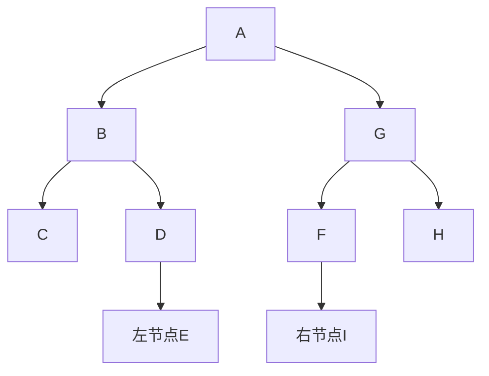
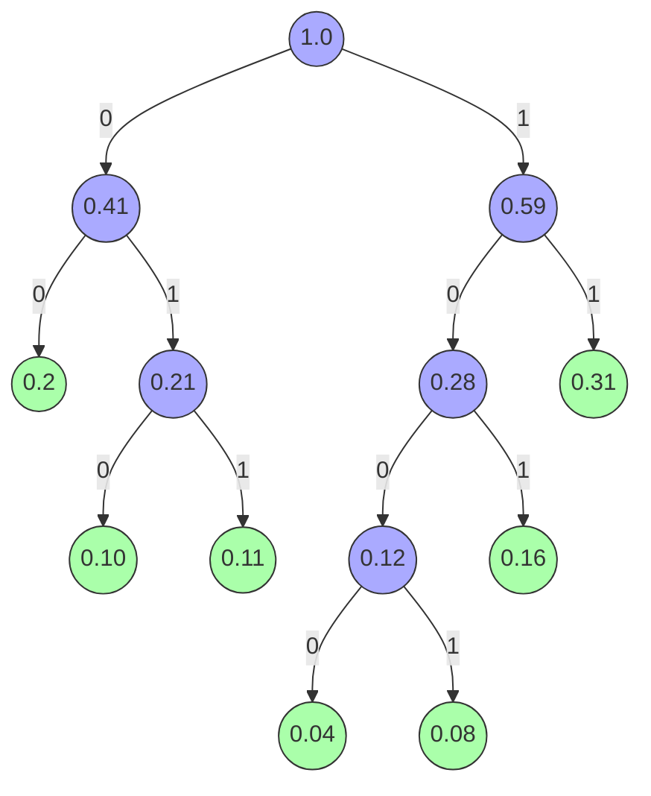

# Chapter 5

> [!note]
>
> 信计 202300091132 杨其霄

## Q2

### (3)


**证明**：考虑使用归纳法，对树的节点数n进行归纳

- 当n=1或2时，结论是平凡的
- 假设当n小于等于k-1时，结论成立
- 当n等于k时，假设二叉树的前序序列为Pre，中序序列为In。
  - 找Pre的首节点a，则二叉树的根节点为a。
  - 在In中找到a。由于无论前序还是中序遍历，子树在序列中都是连续的一部分，可知a左侧部分即为根节点的左子树中序遍历，右侧部分为根节点的右子树中序遍历。
  - 设根节点左子树中序遍历序列所有节点为L，在Pre中找到恰好包含所有L的部分，就得到了根节点的左子树前序遍历。
  - 左子树节点数严格小于k，由归纳假设，可以唯一确定根节点左子树。右子树同理。从而，该二叉树被唯一确定。

### (5)


递归地分析首节点和左子树、右子树部分即可。

1. 根节点为A，左子树中序遍历部分CBED，右子树中序FIGH。左子树后序CEDB，右子树后序IFHG

2. 左子树首节点为B，左孩子为C，右兄弟为D，E为D的左孩子。
3. 右子树首节点为G，左孩子为F，右兄弟为H，I为F的右孩子



### (6)


**解**：先构造Haffman树

W = {0.31, 0.16, 0.10, 0.08, 0.11, 0.2, 0.04} 

-> W = {0.31, 0.16, 0.10, 0.11, 0.2, **0.12(0.08+0.04)**}

-> W = {0.31, 0.16, 0.2, **0.12**, **0.21(0.10+011)**}

-> W = {0.31, 0.2, **0.21**, **0.28**} -> -> W = {0.31, **0.41**, **0.28**} -> W = {**0.41**, **0.59**}

W = {**1**}



Haffman编码：

| 字符 | 概率 | 哈夫曼编码 |
| :--: | :--: | :--------: |
|  a   | 0.31 |     11     |
|  b   | 0.16 |    101     |
|  c   | 0.10 |    010     |
|  d   | 0.08 |    1001    |
|  e   | 0.11 |    011     |
|  f   | 0.20 |     00     |
|  g   | 0.04 |    1000    |

## Q3

### (4)


#### 递归算法：

**基本思路**

- 对于任一节点，下标为k，其左子树首节点下标为2k，右子树首节点下标为2k+1。
- 函数输入root下标k，判断`k >= n || data[k] == '#'`，true则返回空字符。

- 返回当前节点字符值，对下标2k节点进行前序遍历，对下标2k+1节点前序遍历

**伪代码**

```cpp
/**
 * @param tree 树的顺序存储
 * @param n 数组大小
 * @param k 下标
 * @param ans 结果字符串
 */
void preOrder(const vector<char>& tree, size_t n, int k, string& ans) {
    // 空树为{' ', '#'}，数组长度至少为2
    if (n <= 2 && tree[1] == '#') return; // 如果树为空直接返回
    if (k >= n || tree[k] == '#') return; // 下标越界或值为#返回
    ans += tree[k]; // 前序遍历下加入首节点
    preOrder(tree, n, 2 * k, ans);
    preOrder(tree, n, 2 * k + 1, ans);
}
```

**代码**

```cpp
#include <iostream>
#include <vector>

int main() {
    //        A
    //      /   \
    //     B     C
    //    / \   / \
    //   D   E F   G
    std::vector<char> tree1 = {' ', 'A', 'B', 'C', 'D', 'E', 'F', 'G'};
    
    //        A
    //      /   \
    //     B     C
    //    / \     \
    //   D   E     F
    std::vector<char> tree2 = {' ', 'A', 'B', 'C', 'D', 'E', '#', 'F'};
    
    // 空树
    std::vector<char> tree3 = {' ', '#'};
    
    int n1 = tree1.size(); int n2 = tree2.size(); int n3 = tree3.size();

    std::string pre1, pre2, pre3;
    preOrder(tree1, n1, 1, pre1);
    preOrder(tree2, n2, 1, pre2);
    preOrder(tree3, n3, 1, pre3);

    std::cout << pre1 << '\n';
    std::cout << pre2 << '\n';
    std::cout << pre3 << '\n';

    return 0;
}
```

结果：


#### 非递归算法

**基本思路**

维护一个栈，存储树的节点在顺序表中对应的下标。

- 初始化栈，将根节点root下标1压入栈。
- 循环直到栈空：
  - 弹出栈顶元素，下标为k
  - 访问tree[k]的值，加入到结果字符串中
  - 先访问右节点tree[2k+1]，下标不越界且值不为#，将2k+1压入栈。再访问左节点tree[2k]进行同样操作。

**伪代码**

```cpp
std::string preOrder(const std::vector<char>& tree) {
    if (tree.size() <= 2 && tree[1] == '#') {
        return "";
    }// tree is empty

    int n = tree.size(); // n是tree数组的大小，比实际元素数多1.
    std::string ans = ""; // 结果字符串
    std::stack<int> stack; // 下标栈
    stack.push(1);

    while (!stack.empty()) {
        int k = stack.top(); // 取栈顶元素
        stack.pop();

        ans += tree[k];

        if (2 * k + 1 < n && tree[2 * k + 1] != '#') {
            stack.push(2 * k + 1);
        } // 右节点合法则加入
        if (k * 2 < n && tree[2 * k] != '#') {
            stack.push(2 * k);
        } // 左节点合法则加入
    }

    return ans;
}
```

**代码**

```cpp
#include <iostream>
#include <string>
#include <vector>
#include <stack>

int main() {
    std::vector<char> tree1 = {' ', 'A', 'B', 'C', 'D', 'E', 'F', 'G'};
    std::vector<char> tree2 = {' ', 'A', 'B', 'C', 'D', 'E', '#', 'F'};
    std::vector<char> tree3 = {' ', '#'};

    std::string ans1 = preOrder(tree1);
    std::string ans2 = preOrder(tree2);
    std::string ans3 = preOrder(tree3);

    std::cout << ans1 << '\n';
    std::cout << ans2 << '\n';
    std::cout << ans3 << '\n';

    return 0;
}
```

结果：


### (8)


**基本思路**

定义辅助函数 `deleteNode(x, node)`，其中：

`x`： 删除的节点值，`node`：当前节点

- 如果 `node == nullptr`，返回。
- 如果 `node->val == x`：
  - 对node调用clear方法
  - 将node置空
- 否则，递归处理左右子树：
  - `deleteNode(x, node->left)`
  - `deleteNode(x, node->right)`

*其中node类型为引用，从而不用显式将前驱节点记录下来再对子节点置空*

clear(Node* node):

- 如果为nullptr，返回
- 对left调用clear
- 对right调用clear
- delete node

**伪代码**

```cpp
void clear(Node* node) {
    if (node == nullptr) {
        return;
    }
    clear(node->left);
    clear(node->right);
    delete node;
}

void deleteXHelper(const T& x, Node*& node) {
    if (node == nullptr) {
        return;
    }
    if (node->data == x) {
        clear(node);
        node = nullptr;
        return;
    }
    deleteXHelper(x, node->left);
    deleteXHelper(x, node->right);
}
```

**代码**

主要代码作为BST类的成员函数实现，test code：

```cpp
#include <iostream>
#include "../Trees/BST.h"

int main() {
    std::vector<int> data1 {3, 2, 2, 5, 8, 1};
    BST<int> bst1(data1);

    std::vector<int> data2 {};
    BST<int> bst2(data2);

    std::vector<int> data3 {3, 2, 2, 5, 8, 1};
    BST<int> bst3(data3);

    bst1.print();
    bst1.deleteX(2); // 删除2
    bst1.print();

    bst2.print();
    bst2.deleteX(2); // 对空树删点
    bst2.print();

    bst3.print();
    bst3.deleteX(7); // 删除树中没有的点
    bst3.print();

    return 0;
}

```

结果如下，其中树是从左到右的：


### (9)


**基本思路**

- 输入一个节点node，如果node为空，返回
- 否则，交换node的左右节点指针，再对node的左孩子、右孩子调用交换函数

**伪代码**

```cpp
void exchangeHelper(Node* node) {
    if (node == nullptr) return;
    Node* tmp = node->left;
    node->left = node->right;
    node->right = tmp;

    exchangeHelper(node->left);
    exchangeHelper(node->right);
}
```

**代码**

```cpp
#include <iostream>
#include <vector>
#include "../Trees/BST.h"

int main() {
    std::vector<int> vec {3, 2, 8, 5, 0, 8};
    BST<int> bst(vec);

    bst.print();
    bst.exchange();
    bst.print();

    return 0;
}
```

结果：


树是从左到右的，可见正确反转了所有的左右节点
