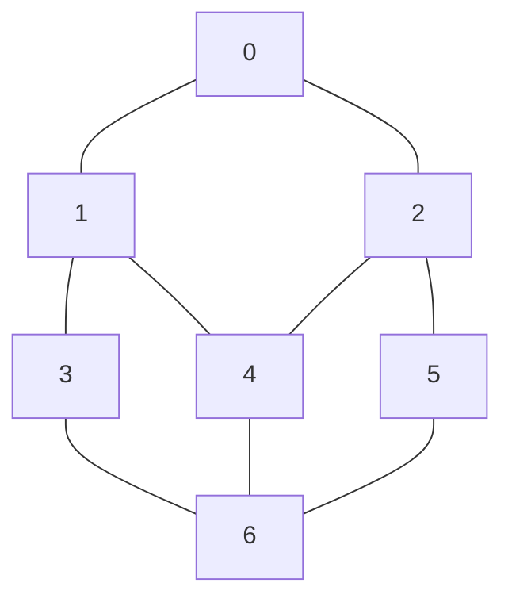
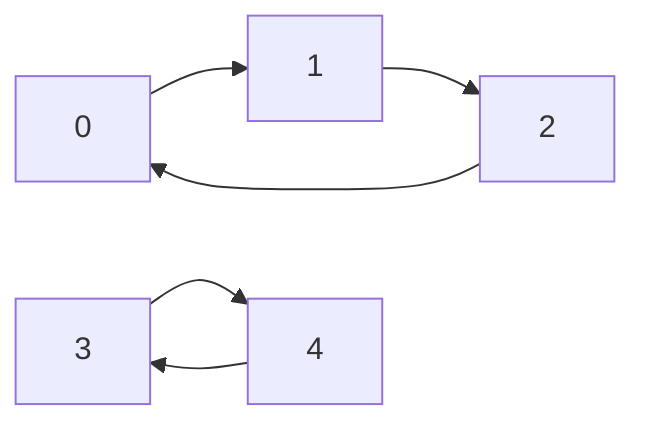

# Chapter 6

> [!note]
>
> 信计 202300091132 杨其霄

## q2

### (4)


**证明**：反证法，假设最长路径L上的起点A的度不为1，则A至少与两个点相连。由于A在L上，A必和L上的一个点u相连，考虑另一个点v。

显然v不可能在L上，否则会出现圈，这与生成树矛盾。因此v不在L上，此时以v为起点，（v, L)是一条更长的路径，这与L为最长路径矛盾。

因此起点A的度只能为1，终点证明类似。

### (6)


**Prim**:

从a出发，维护三个集合`visited`，`dist`和`edge`，分别表示已访问节点，节点到visited集合的最短距离，MST边集

初始化：`visited = {0, 0, 0, 0, 0, 0}`，`dist = {0, inf, inf, inf, inf, inf}`

- 加入a，visited = {a}，更新dist, edge = {}

​	`dist = {0, 6, 3, inf, inf, inf}`

- 加入c，visited = {a, c}，更新dist，edge = {ac}

​	`dist = {0, 6, 3, 6, 6, inf}`

- 加入b，visited = {a, b, c}，更新dist，edge = {ac, ab}

  `dist = {0, 6, 3, 1, 6, 5}`

- 加入d，visited = {a, b, c, d}，更新dist，edge = {ac, ab, bd}

​	`dist = {0, 6, 3, 1, 6, 5}`

- 加入f，visited = {a, b, c, d, f}，更新dist，edge = {ac, ab, bd, df}

​	`dist = {0, 6, 3, 1, 2, 5}`

- 加入e，visited = {a, b, c, d, e, f}，edge = {ac, ab, bd, df, ef}

故MST：edge = {ac, ab, bd, df, ef}，最先边权值之和为17

**Kruskal**：
先将边的权重排序：

{1， 2， 3， 5， 5， 6， 6， 6}

- 加入db
- 加入ef
- 加入ac
- 加入df
- 不能加入权重为5的bf，会形成圈。加入ab。此时已经加入了5条边，算法停止

结果：edge = {ac, ab, bd, df, ef}

### (7)


从v1开始，维护数组dist，表示到节点v1的距离；数组final，记录节点是否不再访问；数组parent，记录前驱节点。node列中加粗节点表示当前正在访问的节点。

| node   | dist | final | parent |
| ------ | ---- | ----- | ------ |
| **v1** | 0    | true  |        |
| v2     | inf  | false |        |
| v3     | inf  | false |        |
| v4     | inf  | false |        |
| v5     | 11   | false | 1->5   |
| v6     | inf  | false |        |
| v7     | 7    | false | 1->7   |

| node   | dist | final | parent |
| ------ | ---- | ----- | ------ |
| v1     | 0    | true  | 1      |
| v2     | 22   | false | 7->2   |
| v3     | inf  | false |        |
| v4     | 13   | false | 7->4   |
| v5     | 11   | false | 1->5   |
| v6     | inf  | false |        |
| **v7** | 7    | true  | 1->7   |

| node   | dist | final | parent |
| ------ | ---- | ----- | ------ |
| v1     | 0    | true  | 1      |
| v2     | 22   | false | 7->2   |
| v3     | inf  | false |        |
| v4     | 13   | false | 7->4   |
| **v5** | 11   | true  | 1->5   |
| v6     | inf  | false |        |
| v7     | 7    | true  | 1->7   |

| node   | dist | final | parent |
| ------ | ---- | ----- | ------ |
| v1     | 0    | true  | 1      |
| v2     | 22   | false | 7->2   |
| v3     | inf  | false |        |
| **v4** | 13   | true  | 7->4   |
| v5     | 11   | true  | 1->5   |
| v6     | 16   | false | 4->6   |
| v7     | 7    | true  | 1->7   |

| node   | dist | final | parent |
| ------ | ---- | ----- | ------ |
| v1     | 0    | true  | 1      |
| v2     | 22   | false | 7->2   |
| v3     | 25   | false | 6->3   |
| v4     | 13   | true  | 7->4   |
| v5     | 11   | true  | 1->5   |
| **v6** | 16   | true  | 4->6   |
| v7     | 7    | true  | 1->7   |

| node   | dist | final | parent |
| ------ | ---- | ----- | ------ |
| v1     | 0    | true  | 1      |
| **v2** | 22   | true  | 7->2   |
| v3     | 25   | false | 6->3   |
| v4     | 13   | true  | 7->4   |
| v5     | 11   | true  | 1->5   |
| v6     | 16   | true  | 4->6   |
| v7     | 7    | true  | 1->7   |

可得：

- v1->v7->v2
- v1->v7->v4->v6->v3
- v1->v7->v4
- v1->v5
- v1->v7->v4->v6
- v1->v7

## q3

### (2)


**基本思路**

@parameter  `vexNum`: 节点数；`edgeNum`: 边数；`vertices`：头节点数组

创建一个 `vexNum × vexNum` 的零矩阵。遍历头节点数组中每个顶点，沿其邻接链表访问所有邻居，将边权重填入矩阵对应位置。

**伪代码**

```cpp
template <typename T>
std::vector<std::vector<T>> toMatrix() {
    std::vector<std::vector<T>> matrix(vexNum_, std::vector<T>(vexNum_, 0)); // 创建二维零矩阵
    for (int i = 0; i < vexNum_; i++) { // 遍历头节点数组
        EdgeNode<T>* p = vertices_[i].firstEdge_;
        while (p != nullptr) { // 访问邻居节点
            int j = p->adjVex_; // 邻接节点标号
            matrix[i][j] = p->weight_; // 邻接节点权重，在矩阵对应位置赋值
            matrix[j][i] = p->weight_; // 保证矩阵对称
            p = p->next_;
        }
    }
    return matrix;
}
```

**代码**

```cpp
#include "MGraph.h"
#include "ALGraph.h"

int main() {
    std::vector<std::vector<int>> mat = {
        {0, 1, 1, 0},
        {1, 0, 1, 1},
        {1, 1, 0, 1},
        {0, 1, 1, 0},
    };

    UndirectedALGraph<int> al_graph(4, mat);
    al_graph.print();
    UndirectedMGraph<int> m_graph = al_graph.toMatrix();
    m_graph.print();

    return 0;
}

```

结果：


### (6)


**基本思路**

维护一个栈stack模拟递归调用：

- 将起始顶点入栈并标记已访问。

- 重复以下步骤至栈空：

  - **出栈**：弹出栈顶顶点，加入遍历结果。

  - **扩展**：遍历该顶点的所有邻居，未访问的立即标记并入栈

栈的 LIFO 特性使最后入栈的邻居最先被处理，因此算法优先沿一条路径深入，直到尽头才回溯到上一个分叉点继续探索，也就是算法是深度优先的。

**伪代码**

```cpp
std::vector<int> dfs_iter() {
    std::vector<bool> visited(vexNum_, false); // 标记是否访问 
    std::vector<int> ans; // 结果数组
    std::stack<int> stack; 

    stack.push(0); // 初始化
    visited[0] = true;

    while (!stack.empty()) {
        int top = stack.top();
        stack.pop();
        ans.push_back(top);

        EdgeNode<T>* p = vertices_[top].firstEdge_;
        while (p != nullptr) { // 扩展邻居
            int v = p->adjVex_;
            if (!visited[v]) { // 如果没访问，更新visited并压栈
                visited[v] = true; 
                stack.push(v); 
            }
            p = p->next_;
        }
    }
    return ans;
}
```

**代码**

```cpp
#include "../Graph/ALGraph.h"

int main() {
    std::vector<std::vector<int>> mat = {
        {0, 1, 1, 0, 0, 0, 0},
        {1, 0, 0, 1, 1, 0, 0},
        {1, 0, 0, 0, 1, 1, 0},
        {0, 1, 0, 0, 0, 0, 1},
        {0, 1, 1, 0, 0, 0, 1},
        {0, 0, 1, 0, 0, 0, 1},
        {0, 0, 0, 1, 1, 1, 0},
    };
    UndirectedALGraph<int> alg(7, mat);
    std::vector<int> vec = alg.dfs_iter();
    for (const auto& item : vec) {
        std::cout << item << " ";
    }
    std::cout << "\n";

    return 0;
}

```

结果：


对应图：



### (8)


**BFS**

**基本思路**

- 有效性检查：若 `i` 或 `j` 越界，返回 `false`。若 `i == j`，直接返回 `true`。

- 初始化队列 `queue` 和访问标记数组 `visited`，将 `i` 入队并标记。

- 循环直至队列为空：

  - 出队顶点 `v`。

  - 遍历 `v` 的邻居：若邻居等于 `target`，提前返回 `true`；否则标记并入队

- 循环结束还未找到说明不存在路径，返回false

```cpp
bool hasPathBfs(int i, int j) {
    // 判断ij有效
    if (i < 0 || i >= vexNum_ || j < 0 || j >= vexNum_) {
        return false;
    }
    if (i == j) { // 找到目标点
        return true;
    }

    std::queue<int> queue;
    std::vector<bool> visited(vexNum_, false);

    queue.push(i); // 初始化标记i并入队
    visited[i] = true;

    while (!queue.empty()) {
        int v = queue.front();
        queue.pop();

        EdgeNode<T>* p = vertices_[v].firstEdge_;
        while (p != nullptr) { // 访问v邻居节点
            int t = p->adjVex_;
            if (!visited[t]) {
                if (t == j) {
                    return true; // 入队前判断，省一轮循环
                }
                visited[t] = true;
                queue.push(t);
            }
            p = p->next_;
        }
    }

    return false;
}
```

**DFS**
**基本思路**

1. 有效性检查：若 `i` 或 `j` 越界，返回 `false`。
2. 初始化 `visited` 和 `hasFound` 标记，将 `i` 标记为已访问。
3. 定义递归辅助函数 `Helper`，对当前顶点 `v`：
   - 若 `v == target`，设置 `hasFound = true` 并返回，进行剪枝。
   - 遍历未访问的邻居，标记并递归调用。
4. 返回 `hasFound`。

```cpp
void hasPathDfsHelper(int v, std::vector<bool>& visited, const int& target, bool& hasFound) {
    if (v == target) { // 找到ij路径
        hasFound = true; // 更新标记并剪枝
        return;
    }
	// 访问邻居节点
    EdgeNode<T>* p = vertices_[v].firstEdge_;
    while (p != nullptr) {
        int t = p->adjVex_;
        if (!visited[t]) {
            visited[t] = true;
            hasPathDfsHelper(t, visited, target, hasFound);
            if (hasFound) return; // 提前剪枝
        }
        p = p->next_;
    }
}


bool hasPathDfs(int i, int j) {
    // 判断ij有效
    if (i < 0 || i >= vexNum_ || j < 0 || j >= vexNum_) {
        return false;
    }

    std::vector<bool> visited(vexNum_, false);
    visited[i] = true;
    bool hasFound = false;
    hasPathDfsHelper(i, visited, j, hasFound);

    return hasFound;
}
```

**代码**

```cpp
#include "../Graph/ALGraph.h"

int main() {
    std::vector<std::vector<int>> mat = {
        {0, 1, 0, 0, 0},
        {0, 0, 1, 0, 0},
        {1, 0, 0, 0, 0},
        {0, 0, 0, 0, 1},
        {0, 0, 0, 1, 0},
    };
    DirectedALGraph<int> al_graph(5, mat);
    al_graph.print();

    // BFS 路径测试
    al_graph.hasPathBfs(0, 0);
    al_graph.hasPathBfs(0, 2);
    al_graph.hasPathBfs(0, 3);
    // DFS 路径测试
    al_graph.hasPathDfs(0, 0);
    al_graph.hasPathDfs(0, 2);
    al_graph.hasPathDfs(0, 3);
    return 0;
}
```

结果：


对应图（有向图，两个互不连通的强连通分量 {0,1,2} 与 {3,4}）：


